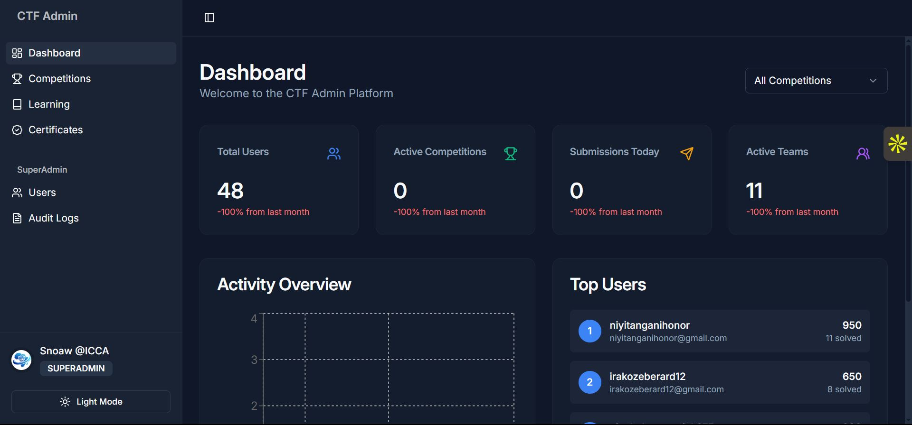
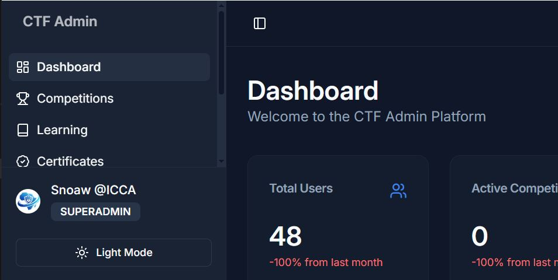
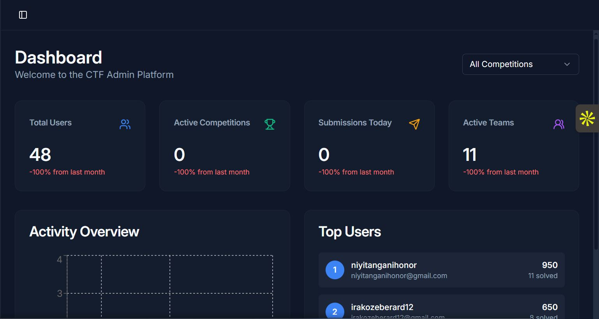
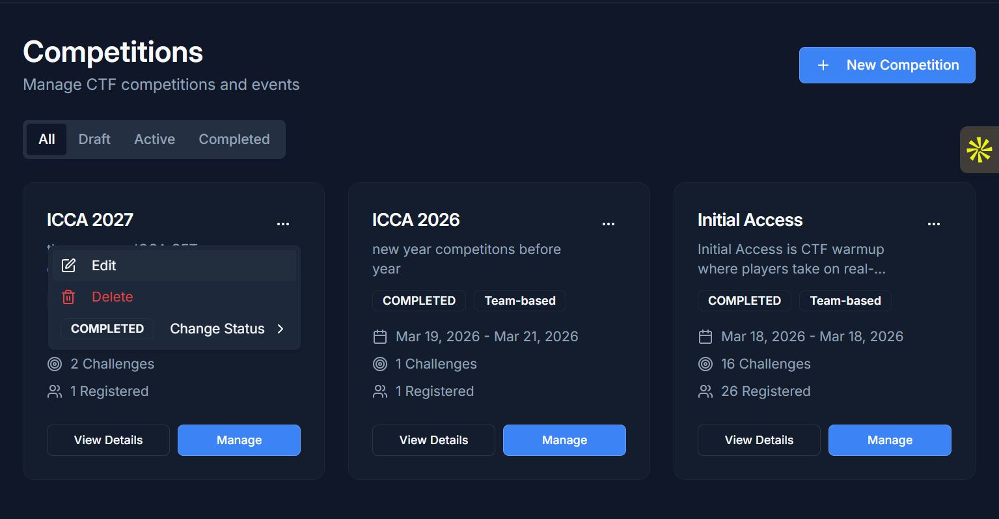
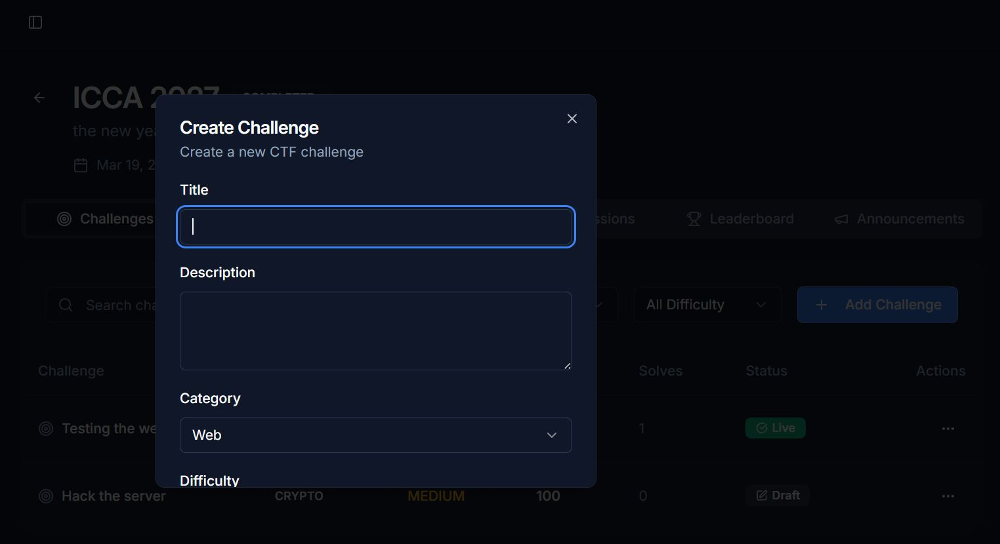
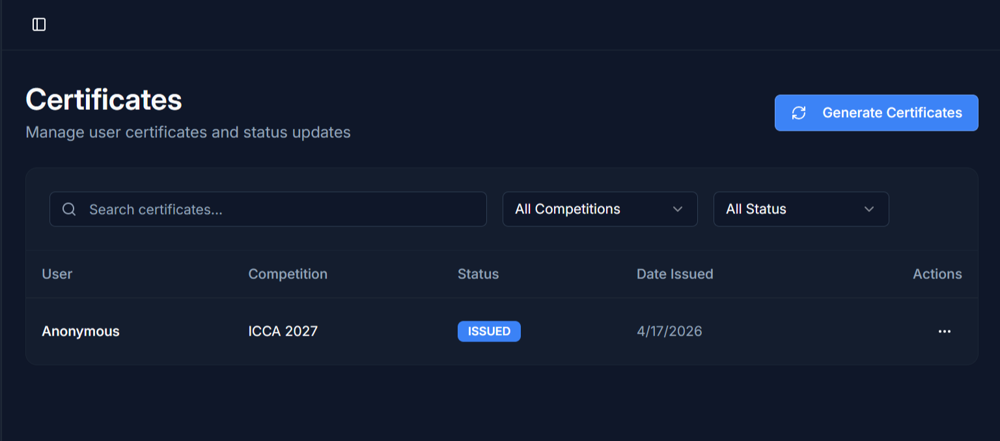
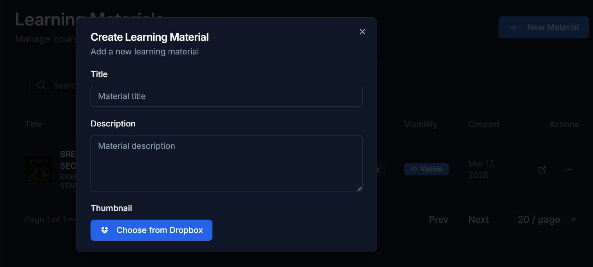
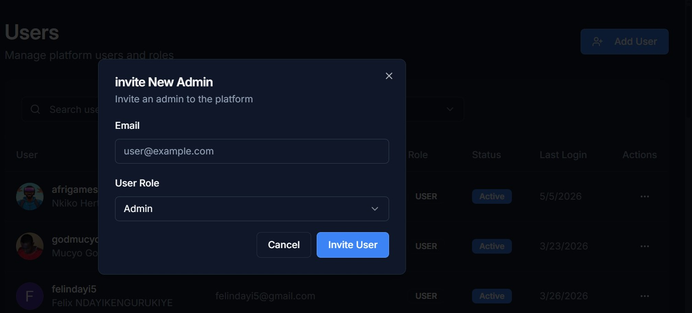
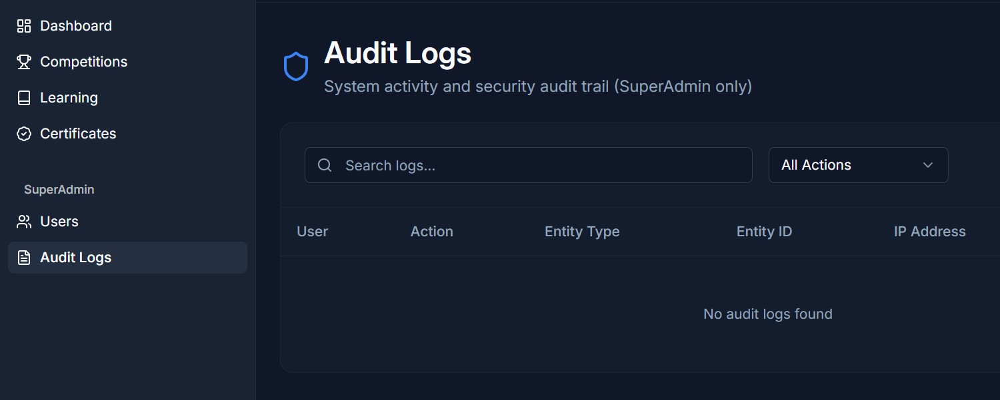
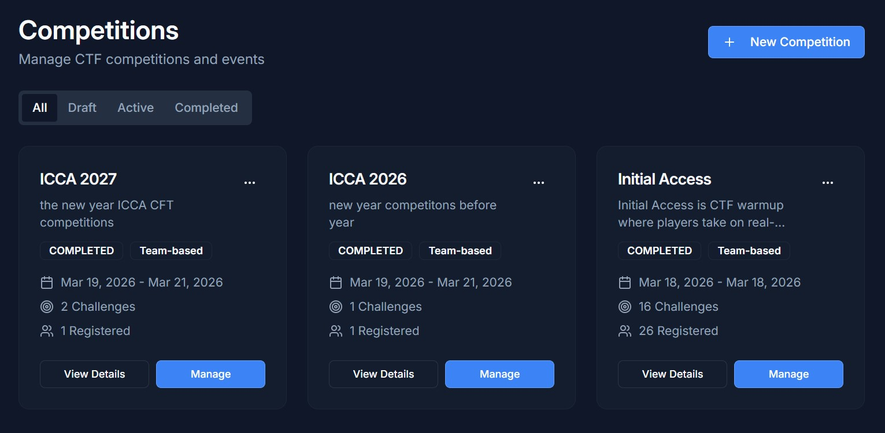

# ICCA CTF — Dashboard Documentation

**Stack:** React · TypeScript · Vite · Tailwind CSS · shadcn/ui · TanStack Query · Clerk Auth · Wouter (routing)  
**Purpose:** Admin management interface for SuperAdmins, Admins, and Creators to manage competitions, challenges, users, certificates, and learning content.

---

## Table of Contents

1. [Overview](#overview)
2. [Architecture](#architecture)
3. [Roles & Access Control](#roles--access-control)
4. [Navigation & Layout](#navigation--layout)
5. [Pages & Features](#pages--features)
6. [Shared Dialogs (Modals)](#shared-dialogs-modals)
7. [Data Fetching Pattern](#data-fetching-pattern)
8. [Theme System](#theme-system)

---

## Overview

The Dashboard is a standalone React SPA that serves as the administrative back-office for the CTF platform. It is accessed by SuperAdmins, Admins, and approved Creators, communicating exclusively with the backend REST API at `/api/v1`.



---

## Architecture

```
dashboard/
├── client/
│   └── src/
│       ├── App.tsx            # Root layout + router
│       ├── components/
│       │   ├── app-sidebar.tsx        # Left navigation sidebar
│       │   ├── DriveImageInput.tsx    # Google Drive image picker
│       │   └── dialogs/               # CRUD modals
│       ├── pages/             # One file per route
│       ├── lib/               # Auth, query client, theme, utils
│       └── hooks/             # Toast, mobile detection
└── server/                    # Thin Express proxy + static server (dev)
    ├── routes.ts
    ├── storage.ts
    └── db.ts
```

The `server/` layer is a lightweight Express wrapper used in development as a local proxy. All real data comes from the NestJS backend.

---

## Roles & Access Control

Role is read from Clerk's `publicMetadata.role`. The sidebar and routes filter themselves in real time based on it.

| Section | SUPERADMIN | ADMIN | CREATOR |
|---|---|---|---|
| Dashboard | ✓ | ✓ | ✓ |
| Competitions | ✓ | ✓ | — |
| Certificates | ✓ | ✓ | — |
| Learning Materials | ✓ | — | — |
| Users | ✓ | — | — |
| Audit Logs | ✓ | — | — |

Non-SuperAdmin users who navigate to SuperAdmin-only pages are silently redirected to `/`.

---

## Navigation & Layout

The shell wraps all pages in a collapsible **left sidebar**, a **top header** with a toggle button, and a **scrollable main area** (`max-w-[1400px]`).



**Main menu items** (role-filtered):

| Label | Route | Visible to |
|---|---|---|
| Dashboard | `/` | ADMIN, SUPERADMIN, CREATOR |
| Competitions | `/competitions` | ADMIN, SUPERADMIN |
| Learning | `/learning` | SUPERADMIN |
| Certificates | `/certificates` | ADMIN, SUPERADMIN |
| Users | `/users` | SUPERADMIN |
| Audit Logs | `/audit-logs` | SUPERADMIN |

---

## Pages & Features

### Dashboard (Overview) — `/`

Default landing page for all roles.



- **Stats Cards** — Total Users, Active Competitions, Today's Submissions, Active Teams, each with a growth % vs. prior period.
- **Competition Filter** — `<Select>` to scope all data to one competition.
- **Activity Chart** — `recharts` `<LineChart>` of daily submissions + signups over time.
- **Top Users Table** — Ranked performers with username, email, total points, solved challenge count.

---

### Competitions — `/competitions`



- **Status Filter Tabs** — All, DRAFT, REGISTRATION\_OPEN, ACTIVE, PAUSED, COMPLETED, CANCELLED.
- **Cards** — Name, color-coded status badge, dates, participant count, challenge count, actions (Edit, Change Status, Delete, Manage).
- **Create** — "+ New Competition" opens `CompetitionDialog`.
- **Change Status** — Submenu in actions dropdown; calls `PATCH /competitions/:id/status`.
- **Manage** — Navigates to `/competitions/:id`.

---

### Competition Detail & Management — `/competitions/:id`



**Header:** Back arrow, competition name, status badge, dates.

| Tab | Contents |
|---|---|
| Overview | Participant / Team / Challenge / Submission stat cards, prizes, rules |
| Challenges | CRUD table; "+ Add Challenge" → `ChallengeDialog`; Edit/Delete per row |
| Teams | Team list with captain, members, score; "+ Create Team" → `TeamDialog` |
| Leaderboard | Ranked list with score, rank badge, solved count |
| Submissions | Searchable: User, Challenge, Flag (masked), Status, Timestamp, IP |
| Announcements | List; "+ Add" → `AnnouncementDialog` |

---

### Certificates — `/certificates`



- **Filters:** Search by name or certificate number; filter by status and competition.
- **Table:** Recipient, Competition, Issued At, Status, Actions.
- **Actions:** Approve or Revoke via `PATCH /certificates/:id/status`.

---

### Learning Materials — `/learning` *(SUPERADMIN only)*

- **Table:** Thumbnail, title, description, Visible/Hidden badge, creator, date, actions.
- **Add** — "+ Add Learning Material" → `LearningMaterialDialog` (title, description, thumbnail, link URL, resources list).
- **Toggle Visibility** — Calls `PATCH /learning-materials/:id/visibility` instantly.

---

### Users — `/users` *(SUPERADMIN only)*

- **Search** — Live filter by username or email.
- **Role Filter** — USER, ADMIN, CREATOR, SUPERADMIN.
- **Table:** Avatar, Username, Email, Role, Active/Inactive badge, Joined, Actions.
- **Actions:** Edit role (`UserDialog`) or toggle status (`PATCH /users/:id/toggle-status`).

---

### Audit Logs — `/audit-logs` *(SUPERADMIN only)*



- **Filters:** Keyword search + action type dropdown (USER\_CREATED, COMPETITION\_DELETED, CERT\_REVOKED, etc.).
- **Table:** User, Action badge (color-coded), Resource Type, Resource ID, Timestamp.

---

## Shared Dialogs (Modals)

All CRUD uses shadcn `<Dialog>` with `react-hook-form` + Zod validation.





| Dialog | Key Fields |
|---|---|
| `CompetitionDialog` | Name, description, dates, max size, team mode, visibility, rules, prizes |
| `ChallengeDialog` | Title, category, difficulty, points, flag, dynamic toggle, Docker image, hints |
| `TeamDialog` | Name, description, max size |
| `AnnouncementDialog` | Title, content, type (INFO/WARNING/HINT), pin toggle |
| `UserDialog` | Role selector |
| `LearningMaterialDialog` | Title, thumbnail (Google Drive picker), link URL, resources list |

---

## Data Fetching Pattern

All API calls go through **TanStack Query** with a custom `apiRequest` wrapper.

```typescript
// Reading
const { data, isLoading } = useQuery({ queryKey: ["/api/v1/competitions"] });

// Mutating
const mutation = useMutation({
  mutationFn: async (id: string) =>
    apiRequest("DELETE", `/api/v1/competitions/${id}`),
  onSuccess: () => {
    queryClient.invalidateQueries({ queryKey: ["/api/v1/competitions"] });
    toast({ title: "Competition deleted" });
  },
});
```

On success, the relevant query cache is invalidated to refetch and keep the UI in sync.

---

## Theme System

Light and dark mode via a custom `ThemeProvider`, persisted in `localStorage`. The sidebar footer Sun/Moon toggle switches themes. Theme is also forwarded to `<Toaster>` (sonner) so notifications match.


