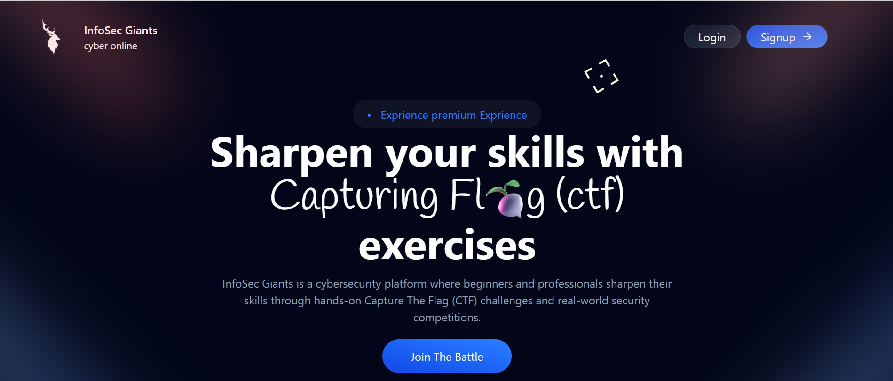
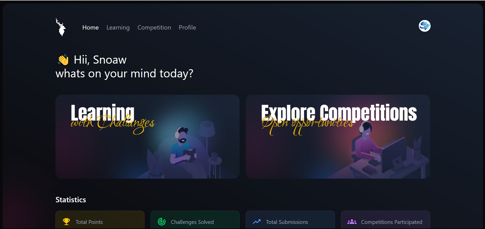
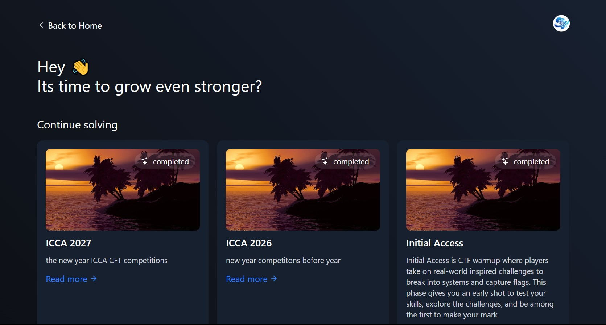
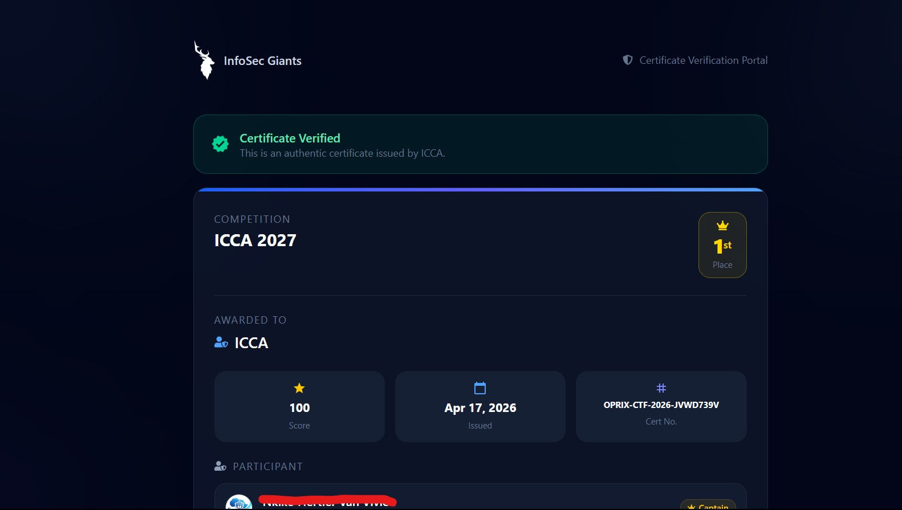
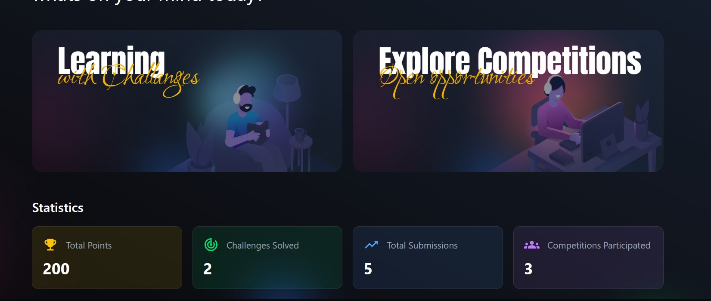
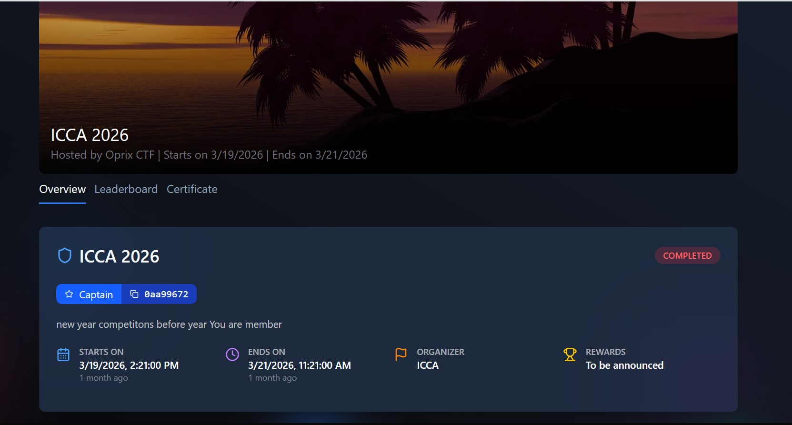
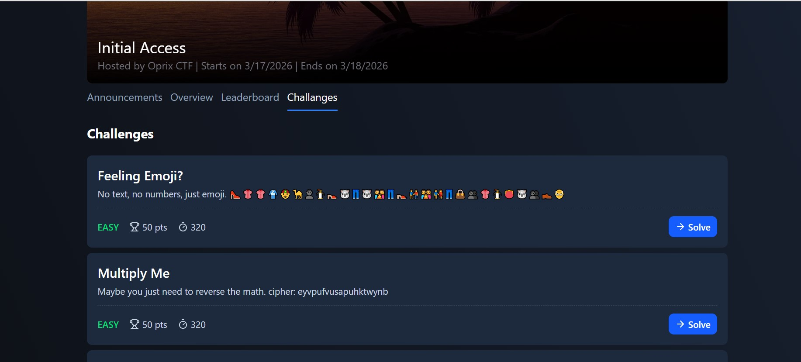
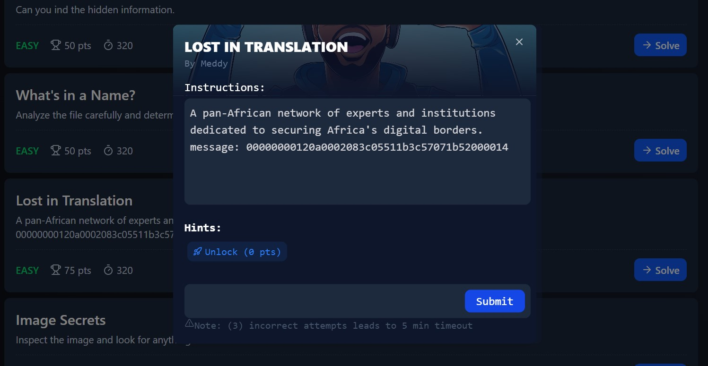
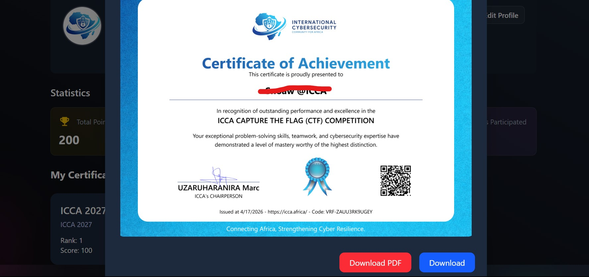
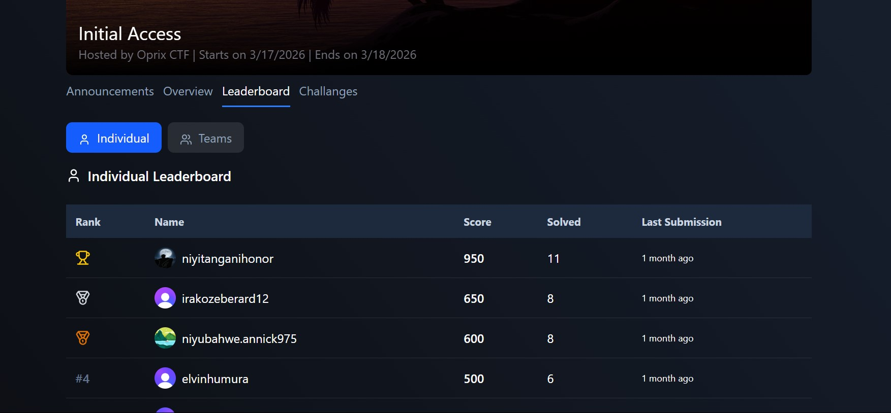

# ICCA CTF — Platform (Client) Documentation

**Stack:** React · TypeScript · Vite · Tailwind CSS · React Router v6 · Clerk Auth · Axios · Sonner (toasts) · Framer Motion  
**Purpose:** Public-facing participant platform — landing pages, competition discovery, active CTF workspace, learning materials, profile management, and certificate verification.

---

## Table of Contents

1. [Overview](#overview)
2. [Architecture & Routing](#architecture--routing)
3. [Layouts](#layouts)
4. [Landing Zone](#landing-zone)
5. [Auth Zone](#auth-zone)
6. [Platform Zone (Authenticated)](#platform-zone-authenticated)
7. [Competition Workspace Tabs](#competition-workspace-tabs)
8. [Key Components](#key-components)
9. [API Client](#api-client)

---

## Overview

The platform is the primary interface **participants** use. It is split into two experiences:

1. **Public / Landing** — Browse competitions, view details, verify certificates — no sign-in required.
2. **Platform Workspace** — Authenticated area for active competition participation, learning, and profile management.



---

## Architecture & Routing

```
platform/src/
├── App.tsx                   # Clerk + Router root
├── components/
│   ├── AppRouter.tsx          # All route definitions
│   ├── layouts/               # HomeLayout, AuthLayout, PlatformLayout
│   ├── CompetitionsPages/     # Competition sub-tab components
│   └── Models/                # Modal components
├── territories/
│   ├── landing/               # Public pages
│   ├── auth/                  # Sign in / sign up
│   └── platform/              # Authenticated workspace pages
├── lib/
│   ├── api-client.ts          # Axios instance (auto-attaches JWT)
│   └── controllers/           # Challenge + instance logic
├── config/api.config.ts       # Centralized endpoint constants
└── types/index.ts             # All shared TypeScript types
```

### Full Route Map

| Path | Component | Zone |
|---|---|---|
| `/` | `Home2` | Landing |
| `/competitions` | `CompetitionsPage` | Landing |
| `/competitions/:id` | `CompetitionById` | Landing |
| `/certificate-verify/:id` | `CertificateVerify` | Landing |
| `/auth/sign-in` | `SignInPage` | Auth |
| `/auth/sign-up` | `SignUpPage` | Auth |
| `/onboard` | `Onboarding` | Auth |
| `/profile/:id` | `Profile` | Auth layout |
| `/platform/` | `PlatformHome` | Platform |
| `/platform/competition` | `CompetitionPage` | Platform |
| `/platform/competition/:id` | `SingleCompetitionsPage` | Platform |
| `/platform/learning` | `LearningPage` | Platform |
| `/platform/Challanges` | `PlatformPublicChallenges` | Platform |
| `/platform/submissions` | `SubmissionsHistory` | Platform |
| `/platform/profile` | `UserProfile` | Platform |
| `/platform/pdf` | `PDFPage` | Platform |

---

## Layouts

**HomeLayout** — Sticky navbar with logo, nav links, and sign-in/sign-up CTAs. Mobile responsive with a hamburger menu. Wraps `/`, `/competitions`, `/competitions/:id`.

**AuthLayout** — Minimal centered card layout for sign-in and sign-up.

**PlatformLayout** — Authenticated wrapper for all `/platform/*` routes. Contains a collapsible left sidebar, top bar with user avatar, and mobile bottom navigation.



---

## Landing Zone

### Home Page — `/`

Dark-themed marketing landing page (`#100E19` background).

- **Hero** — Headline, description, "Get Started" CTA (→ `/auth/sign-in` if signed out, → `/platform/` if signed in)
- **Scroll velocity marquee** — Animated scrolling banner of security keywords
- **Features section** — Cards highlighting platform capabilities

### Competitions Listing — `/competitions`



- **Search** — Client-side filter by name or description
- **Status filter** — Shows DRAFT and REGISTRATION\_OPEN by default
- **Cards** — Name, description, dates, participant type, "View Details" link

### Competition Detail (Public) — `/competitions/:id`



- Hero banner, competition name, host, dates
- Description, rules, prizes
- FAQ section
- "Join Competition" button → `JoinCompetition` modal (sign-in redirect if unauthenticated)
- Participant/team count badges

### Certificate Verification — `/certificate-verify/:id`



**Valid:** Verified badge, recipient name, competition, final rank, total score, issue date, certificate number, team members with role badges.  
**Revoked:** Red "REVOKED" banner with revocation reason.  
**Not found:** Error state.

---

## Auth Zone

**Sign In** (`/auth/sign-in`) — Clerk-hosted UI embedded in the auth layout. Supports email/password and OAuth providers.

**Sign Up** (`/auth/sign-up`) — Clerk-hosted sign-up. Redirects to onboarding on first registration.

**Onboarding** (`/onboard`) — Guided profile setup (username, bio, country, skills) that syncs the account via `POST /auth/clerk`.

---

## Platform Zone (Authenticated)

All `/platform/*` routes are protected by Clerk. Unauthenticated users are redirected to `/auth/sign-in`.

### Platform Home — `/platform/`



- **Welcome Header** — "👋 Hii, {username} — what's on your mind today?"
- **Feature Cards** — Learning, Explore Competitions, Public Challenges, Submissions
- **User Stats Block** — Total Points, Solved Challenges, Total Submissions, Participated Competitions

### Competition Hub — `/platform/competition`

Lists all competitions with a two-column layout: all competitions on the left, "My Competitions" on the right.

- Search + status filter + sort (date, name, participants)
- "Join" → `JoinCompetition` modal; "Enter" if already registered

### Single Competition Workspace — `/platform/competition/:id`

Hero banner (cover image, name, host, dates, difficulty badge) + tabbed workspace below. A `CompetitionStatusModal` auto-shows if the competition is not yet active or has ended.

### Learning Page — `/platform/learning`

- Debounced search, 9 materials per page, pagination controls
- Material cards with thumbnail, title, description, "Open" button
- Tabs: Learning Materials | Practice Challenges

### Public Challenges — `/platform/Challanges`

Publicly visible challenges across all competitions for practice. Category filtering, difficulty badges, solve count. Clicking opens `ChallengePopup`.

### Submissions History — `/platform/submissions`

Personal flag submission log. Columns: Competition, Challenge, Flag (masked), Status (✓/✗), Points Earned, Submitted At. Filterable by competition and status.

### User Profile — `/platform/profile`

Editable profile fields (first/last name, bio, country, website, GitHub, LinkedIn, skills). Stats summary. Saves via `PATCH /users/me`.

---

## Competition Workspace Tabs



### Overview Tab
Competition description, countdown timer, rules, prizes, registration status.

### Challenges Tab



- Challenges grouped by **category** with `ChallengeCard` per challenge (title, points, difficulty, solved indicator)
- **ChallengePopup** modal contents:
  - Description, category/difficulty badges, points, attachments
  - **Hints** — "Unlock Hint" button with point cost; reveals hint text on unlock
  - **Dynamic challenges** — "Launch Instance" → `POST /instances`; shows hostname + port
  - **Flag submission** — Input + Submit button, rate-limit warning after repeated failures
  - **Success** — Confetti animation + "Challenge Solved!" message

### Leaderboard Tab
Ranked list (individual or team mode). Columns: Rank, Name, Points, Solved, Last Solve Time. Top 3 get gold/silver/bronze medals. Current user's row is highlighted.



### Teams Tab *(team-based competitions only)*
All teams with member count and score. "Create Team" and "Join Team" buttons if user has no team. Captains see "Manage Team".

### Members Tab
All registered participants: Avatar, Username, Country, Points.

### Announcements Tab
Chronological announcements. Type badge: INFO (blue), WARNING (orange), HINT (purple). Pinned announcements appear at top.

### Certificates Tab



Available after competition ends. Shows eligibility, "Request Certificate" button (`POST /certificates/request`), and a **Download PDF** button once issued.

---

## Key Components

| Component | Description |
|---|---|
| `ChallengeCard` | Compact challenge card with solve status indicator |
| `ChallengePopup` | Full challenge modal — description, hints, instance, flag submit |
| `JoinCompetition` | Registration modal for individual or team joining |
| `CompetitionStatusModal` | Auto-modal informing user of competition state on entry |
| `UserStats` | Aggregated stats block (points, solves, competitions) |
| `NoContent` | Empty-state component with icon and message |
| `SwitchBack` | "Back to Dashboard" quick link shown to ADMIN/SUPERADMIN users |

---

## API Client

All authenticated calls go through a centralized Axios client (`lib/api-client.ts`) that auto-attaches the Clerk JWT:

```typescript
import getApiClient from '@/lib/api-client';
import { API_ENDPOINTS } from '@/config/api.config';

// Fetch competition
const res = await getApiClient().get(API_ENDPOINTS.COMPETITIONS.GET(competitionId));

// Submit flag
await getApiClient().post(API_ENDPOINTS.SUBMISSIONS.CREATE, {
  challengeId,
  competitionId,
  flag: userInput,
});
```

`API_ENDPOINTS` centralizes all endpoint paths. `lib/error-handler.ts` extracts error messages and triggers toast notifications on failures.
